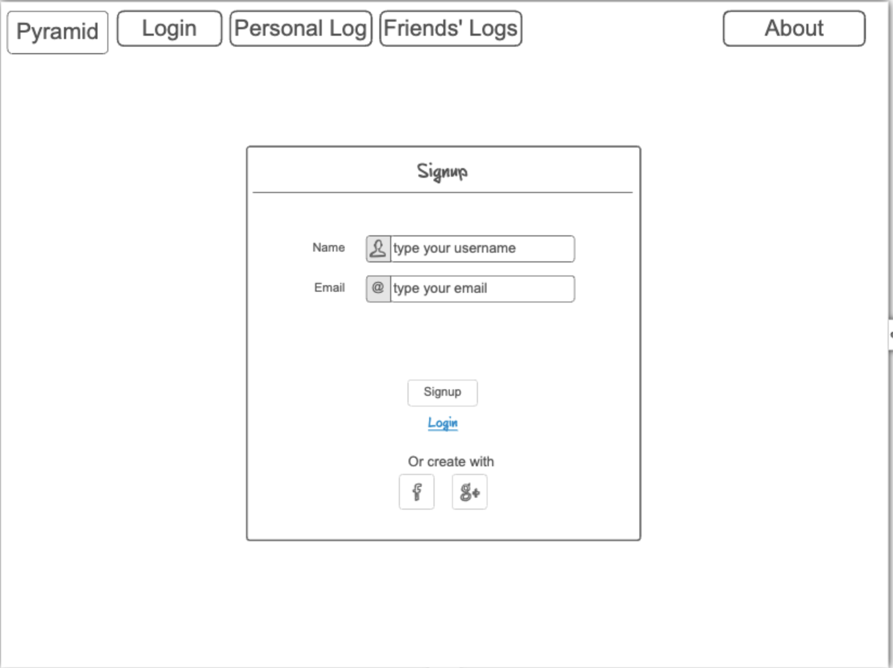
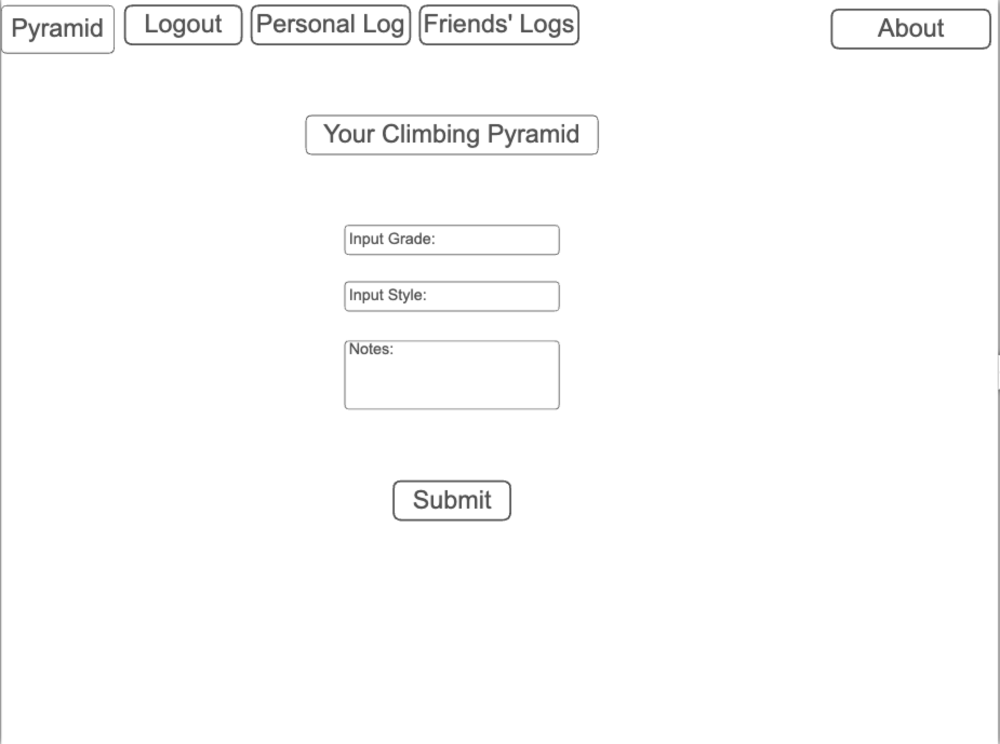
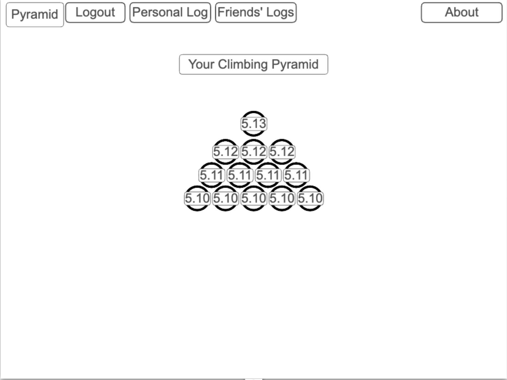
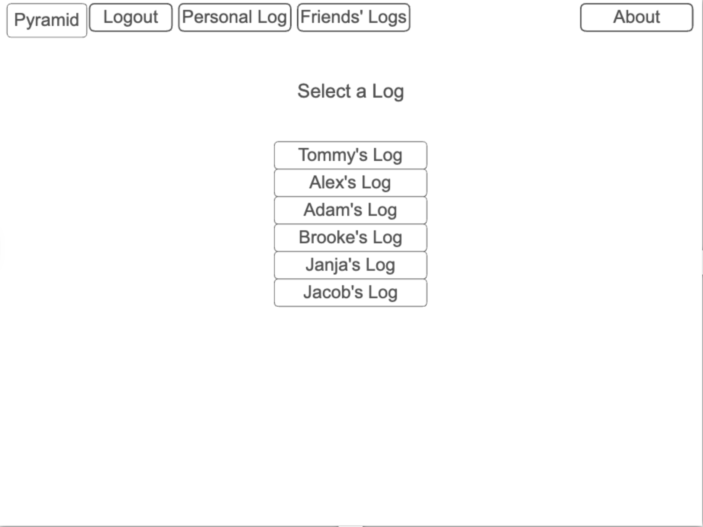

# Pyramid Startup
A repository to hold a personal website.
Here are my [Notes](https://github.com/thelastbrittain/startup/blob/main/notes.md)

## Elevator Pitch
After a year or so of climbing, most climbers feel that they are beginning to plateau. They don’t understand that they will not climb a harder grade every session, and they fail to track their progress. The climbing pyramid theory is that to climb a route ranked 1 grade harder, you must climb 2-3 routes that are 1 grade easier. If you log every climb you’ve ever done, the results appear like a pyramid, with a high quantity of easier climbs as the base and a few, harder routes forming the top. This application helps people track the routes they have climbed and displays their efforts in a pyramid, showing them the progress they really are making. 

## Design

## Key Features
- Secure Login with HTTPS
- Ability to add climbs to a personal log stored on a database
- Ability to view log in pyramid form
- Ability view others' logs and see changes in real time via websocket

## Technologies
-  **HTML** - Uses correct HTML structure for application. 5 HTML pages. One for login, one for submitting a climb, one for viewing your pyramid, one for viewing list of other people who have posted a pyramid, one About page
- **CSS** - Use for styling, color choice, and resizing based on color choice
- **JavaScript** - Handles login, adding a climb, properly displaying the pyramid, properly displaying other users, and backend endpoint calls.
- **React** - Single page application utilizing React Router to connect pages and dynamically display data. 
- **Service** - Backend service with endpoints for:
  - Submitting a route
  - Retrieving other user’s pyramid
  - Showing stock climbing images after submitting a climb (Pexels)
- **DB/Login** - Store account credentials and personal pyramids. Authentication required to create personal pyramid
- **WebSocket** - When a user submits a climb, their pyramid is updated for everyone

## HTML deliverable
 - [x] HTML pages - Five HTML pages that represent the ability to login, view logs, see friends, add to your log, and congratulate for adding to a log. 
 - [x] Links - Links to each page except the congrats page, is displayed on a header on each page. The login page automatically links to the add log page. The log page automatically links to the congrats page, which links back to the log page. 
 - [x] Text - There is text in the about page describing the website as well as descriptive p tags and h tags scattered throughout the website
 - [x] Images - There is an image on the congrats page - this will be an API call 
 - [x] DB/Login - Input box and submit button for login. The friends list will also be pulled from the DB
 - [x] WebSocket - Real time updates to logs will utilize the WebSocket 
